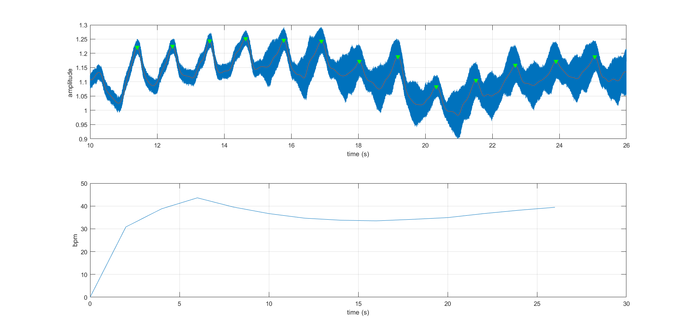

# PlutoSDR Doppler Respiration Monitor

MATLAB script RRatemain.m uses ADALM-PLUTO SDR to monitor human respiration rate using a CW Doppler radar principle.

## 🧠 How It Works
- Transmits a continuous 300 Hz tone at 2.4 GHz using PlutoSDR
- Receives reflections using PlutoSDR RX path
- Unwraps phase changes caused by chest movement
- Extracts envelope and detects breathing peaks
- Calculates breathing rate (BPM) and classifies it as:
  - Slow
  - Normal
  - Fast
  - Apnea
  - Dead

## 🛠 Requirements
- MATLAB R2020a or newer
- Communications Toolbox
- ADALM-PLUTO SDR connected via USB

## 📈 Sample Output

